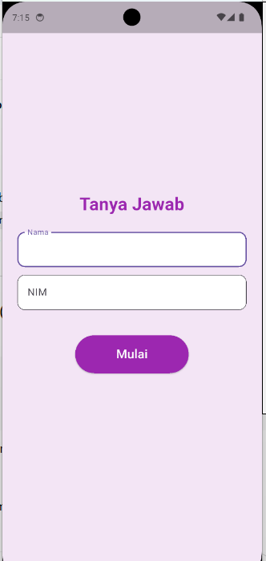
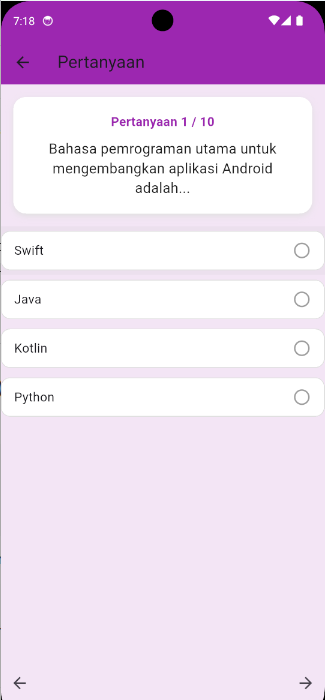
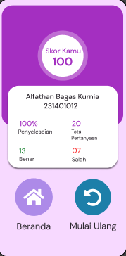

# Aplikasi Tanya Jawab

**Nama          :** Alfathan Bagas Kurnia  
**NIM           :** 231401012  
**Lab           :** Lab 5 Pemrograman Mobile  

---

## Deskripsi Aplikasi

Aplikasi Tanya Jawab adalah aplikasi pilihan ganda sederhana yang dikembangkan untuk membantu pengguna dalam menguji pengetahuan dasar melalui serangkaian pertanyaan interaktif dengan format multiple choice.

Pengguna dapat memilih jawaban dari beberapa opsi yang tersedia, lalu langsung melihat hasil atau skor dari setiap sesi kuis.

Proyek ini dikembangkan menggunakan bahasa pemrograman dart dan framework flutter, sehingga dapat digunakan di android dan iOS.

**Fitur Utama:**
* Input Nama Pengguna
* Quiz Page
* Penyimpanan Jawaban Sementara
* Skor
* Tombol Ulangi Kuis

## Screenshot / Video Aplikasi

## Link Mockup dan Prototype

[Tanya Jawab Mobile](https://www.figma.com/design/7mTTi0q206kSzIkx7pKwEO/Tanya-Jawab-Mobile?node-id=1-5&t=O9lWG9vwkN88CfEY-1)

## Credit dan Sumber Aset

[Quiz App UI Design (Community)](https://www.figma.com/design/4QXqvBY5XJy5ji1OYTP0RZ/Quiz-App-UI-Design--Community-?node-id=10-81&t=rfXT79wQb7KBF30H-0)

## Referensi

[Quiz App UI Design (Community)](https://www.figma.com/design/4QXqvBY5XJy5ji1OYTP0RZ/Quiz-App-UI-Design--Community-?node-id=10-81&t=rfXT79wQb7KBF30H-0)

